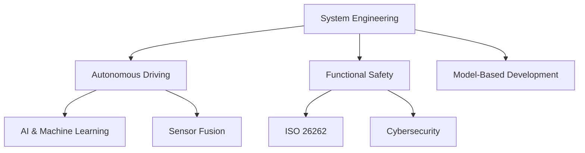

    

        
    

    

        <h1>🚀 Alexander Zimmerer | Portfolio</h1>  
        <h2>👨‍💻 About Me</h2>
        
Experienced Team Manager with over 10 years in <strong>System Engineering & Software Architecture</strong>, specializing in <strong>Autonomous Driving, Functional Safety, and Model-Based Development</strong>. Passionate about innovation, agile methodologies, and high-performing teams.

    

## 🌍 Mission & Vision
I believe that **technology should empower people**. My goal is to develop **safe, intelligent, and efficient systems** that improve mobility and quality of life. Through **continuous learning, innovation, and collaboration**, I strive to shape the future of **autonomous systems and robotics**. 

## 📜 Resume
[📥 Download my CV](./ressources/CV_AlexanderZimmerer.pdf)

## 🌟 Skills & Expertise

## 📬 Contact
📧 [Email](mailto:alexander.zimmerer1988@gmail.com)  
🔗 [LinkedIn](https://www.linkedin.com/in/alexander-zimmerer-97620275/)  
🐙 [GitHub](https://github.com/AlZi-88)
